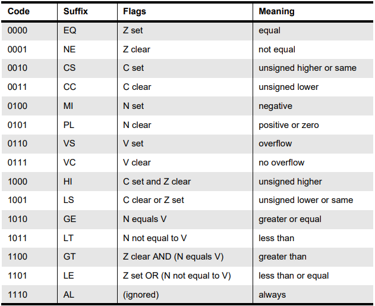

# Conversor de assembler para binário do processador ARM:

O presente programa faz a conversão de instruções escritas em assembler para o respectivo código binário interpretado pelo processador.

## Como usar o programa:
Na mesma pasta do código arm.py, coloque um arquivo code.txt com as instruções que devem ser convertidas:


Rode o código arm.py com o comando:
```python3 arm.py```

As instruções codificadas irão aparecer no terminal:


## Instruções implementadas:
Abaixo está a explicação de como o código funciona em cada conjunto de instruções. 

Cada conjunto de instruções terá uma seção Assembler Syntax, onde está a sintaxe do código assembler, e uma seção Enconding, onde estará um diagrama explicando como é feita a codificação das instruções.

### Instruções de Salto:

<b>Branch and Branch with Link (B, BL):</b>

Assembler syntax: 
B{L}{cond} <#expression>

Encoding:


<b>Branch and Exchange (BX):</b> 

Assembler syntax: 
BX{cond} Rn

Encoding:


### Instruções de acesso à memória:

<b>Load e Store (LDR, STR):</b> 

Assembler syntax: 
<LDR|STR>{cond}{B}{T} Rd \<Address>

Encoding:


### Instruções ALU:

Assembler syntax: 
<b>Instruções CMP, CMN, TEQ, TST:</b>
\<Mnemonic>{cond} Rn \<Op2> 
<b>Instruções AND, EOR, SUB, RSB, ADD, ADC, SBC, RSC, ORR, BIC:</b>
\<Mnemonic>{cond}{S} Rd Rn \<Op2>

Onde:
- \<Mnemonic> é uma das opções da primeira coluna da tabela:

- \<Op2> define o segundo operador pode ser Rm{,\<shift>} ou <#expression>
- {cond} é nulo ou uma das opções da Tabela de Condições (*).
- {S} define códigos de condição se S estiver presente (implícito para CMP, CMN, TEQ, TST).
- Rn  é o registrador do primeiro operador.
- Rm é o registrador do primeiro operador.
- Rd é o registrador de destino.

Encoding:


### Tabela de condições (*):


Onde:
- A coluna Code apresenta as condições em código binário.
- A coluna Suffix apresenta os mnemônicos usandos no código assembler.
- A coluna Flags apresenta como as flags são configuradas.
- A coluna Meaning apresenta o significado de cada condição.


<b> Todos os diagramas e tabelas presentes neste documento foram retirados do Data Sheet ARM7TDMI-S</b>